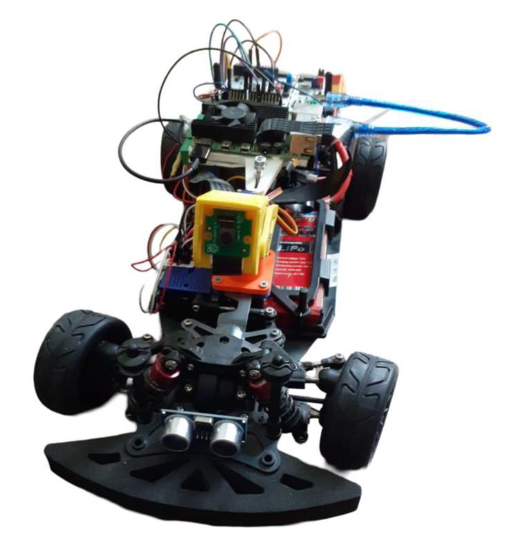
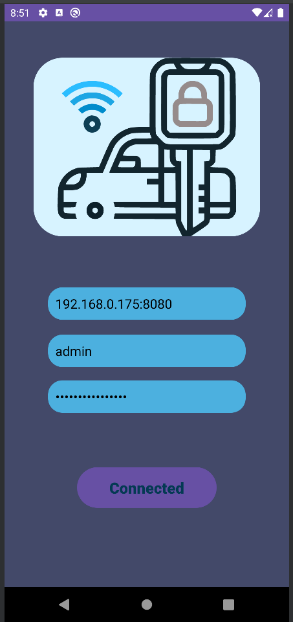
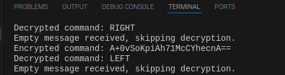
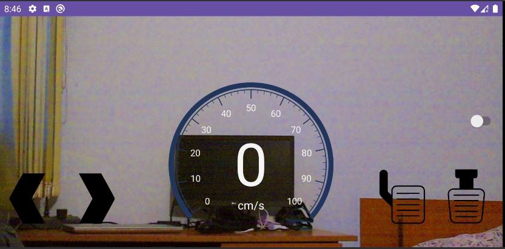

# GUI-Car_Control-Android
# RoboCar Control - Android App Using TCP/IP & HTTP  

This Android application allows users to connect to a Raspberry Pi and control a RoboCar remotely. The app utilizes **TCP/IP** for command transmission and **HTTP** for video streaming.  

## Features  

- **Connection to Raspberry Pi**  
  - Establishes a stable connection via **TCP/IP**.  
  - Sends control commands for movement (forward, backward, left, right, stop).  

- **Live Video Streaming**  
  - Uses **HTTP protocol** to receive real-time video feed from Raspberry Pi's camera.  

- **Secure Communication**  
  - Implements **data encryption and decryption** for enhanced security.  

## Screenshots  

### 1. RoboCar Model  
  

### 2. Connection Interface  
  

### 3. Data Encryption & Decryption  
  

### 4. Landscape Mode Layout  
  

### 5. Portrait Mode Layout  
  

### 6. System Schematic Diagram  
  

## Technologies Used  

- **Java/XML** – UI and application logic.  
- **TCP/IP Protocol** – Communication between Android app and Raspberry Pi.  
- **HTTP Protocol** – Real-time video streaming.  
- **Encryption/Decryption** – Secure data exchange.  
- **Android Studio** – Development environment.  

## Installation  

1. Clone the repository:  
   ```sh
   git clone https://github.com/crscristian/GUI-Car_Control-Android.git
